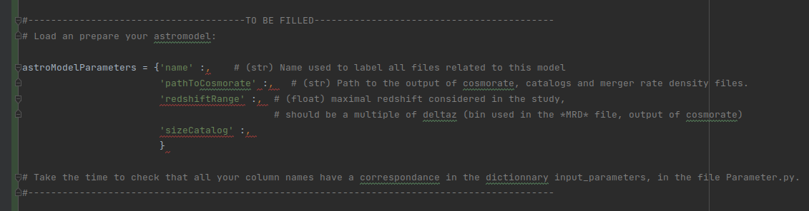

_**BBlack** is program developed by Carole Perigois ([carolperigois@outlook.com](mailto:carolperigois@outlook.com)) based on the BayesBlack, with the authorization of its developper, Yann Bouffanais, with the support of from the European Research Council for the ERC Consolidator grant DEMOBLACK, under contract no. 770017._

# BBlack

BBlack is a program made to compare astrophysical models, using Gravitational wave observations and hierarchical bayesian inference. This program has threen main usages:

* The build of astrophysical catalogues
* The hierachical bayesian analysis to compare models to each other
* The Multi-channel analysis to get the proportion of each black hole formation channel.


# Code requirements

The code has been tested on version of Python 3.9.2

The modules required for the code to work are :
numpy, pandas, astropy, **pycbc (set it to version 1.18.0, there is a bug for higher versions)**, emcee , scipy, matplotlib, corner, schema


# Quick start

* **Prepare the structure**: Create a folder named after your project in the BBlack repository and copy inside the two files _GettignStarted.py_ and _Parameters.py_.
* **Fill your analysis parameters**: In the file _GettingStarted.py_ are highlighted blocks (see after), which should be filled by the user.

<p align="center" width="100%">
    
</p>

\#--------------------------------------TO BE FILLED------------------------------------------

# Load an prepare your astromodel:

astroModelParameters = {'name' :,    # (str) Name used to label all files related to this model
                        'pathToCosmorate' :,   # (str) Path to the output of cosmorate, catalogs and merger rate density files.
                        'redshiftRange' :,  # (float) maximal redshift considered in the study, should be a multiple of deltaz (bin used in the *MRD* file, output of cosmorate)
                        'sizeCatalog' :,    
                        }

\#--------------------------------------------------------------------------------------------


# Structure recomandation

For an easy use, the devolper strongly suggest for every new project to create a new repository inside BayesBlack, with a copy of the two files GettingStarted.py and Parameters.py.
In this directory the program will store all the data (results, catalogs, list of events etc... ) related to this specific project.

# Quick start

The file GettingStarded.py is build to be read and filled step by step by the user with the file Parameter.py.
The folder example contains an example of analysis, which can be used as a first run of the code.

For its first personal analysis,  


# Tutorial

This short tutorial exposes what are the main steps to do when starting a new project. 

## Git clone the project

Use git clone to fetch the newest version of the code in a new directory for the project

## Copy CosmoRate files locally

As the code rewrites CosmoRate files, it is **mandatory** to copy the files that you need from CosmoRate in the local directory where you have your codes. In the current version of the code, the format expected for the catalog files is of the form ```text_i_x.dat``` where ```text``` is an ensemble of any character, ```i``` is an integer that identifies the redshift bin and ```x``` is a value that qualifies the quantiles for the merger rate density of CosmoRate (x=50 is the default and corresponds to the median). 

For instance, the name ```BBH_zmerg_A0.5_122_50.dat``` is indeed considered as a catalog file. 

**In the current version of the code, the files expected from one project should only contain one value of x (both for the catalogs and merger rate density). If you want to re-run the code for another value of percentile (like x= 75, 25), you have to create another input files directory.**

## Define how models are parametrised : setup Project_modules/astro_model.py

Our final goal is to compare different models using Bayesian analysis. This means that we need to distinguish each model according to their properties, that are represented mathematically by a set of hyper-parameters lambda. 

Go to ```astro_model.py``` in the directory ```Project_modules```. This python script defines a class AstroModel that contains three class variables that you need to adjust for each project.
1. ```astro_model_parameters_available``` is a dictionary where the keys are the name of each hyper-parameter associated to the project and the values are lists of available values for this hyper-parameter. 
2. ```astro_model_schema``` is a Schema object where the keys are the the name of each hyper-parameter associated to the project and the values are the types expected for the hyper-parameter.
3. ```map_name_par``` is a dictionary where the keys are the name of each hyper-parameter associated to the project and the values are the string that will preeceeds the hyper-parameter value in all output files created. <br />e.g. : for a hyper-parameter representing the compact object type "co_type" with a mapped name "co", a model where the compact object type is BBH will create output file name of the form "...\_co_BBH\_..."


## Setup your model file : setup ```astro_model_param.py```

The goal of ```astro_model_param.py``` is to set the properties of one specific astrophysical model. This script is not an executable, but will be called by all the other scripts to initialize the astrophysiscal models. It contains an unique function return_astro_param with an input argument ```sysargv``` that corresponds to the list of parameters that are inputted when calling a script (i.e. ```sys.argv```).

Here are the important points that the user needs to fill
1. Fill the values for the hyper-parameter corresponding to the model at hand. There are two ways of feeding the values:
    * Assign all values by hand for each parameter. In this case, make sure that all hyper-parameters are represented and the values are correctly set
    * Use the values that were inputted when calling one of the script (with ```sys.argv```). In this case, make sure that you control the order of the arguments and that all hyper-parameters are represented
2. Define the dictionary ```astro_param``` with the keys and values for the hyper-parameters. This dictionary should follow the structure that you set in the previous step
3. Set the value of ```dir_cosmo_rate``` that indicates the path towards the files of CosmoRate corresponding to the model at hand.
4. Indicate what compact object parameters (masses, redshift, spins...) you want to use for the study in ```co_param```
5. If you have selected a spin-related variable, you need to specify what fiducial model you want for the spins. There are two variables to fill
    * ```mag_gen_param``` is a dictionary containing parameters that qualify how to generate the magnitude of the spin. In the current version, the only distribution available (in the key "name_dist") is "Maxwellian". It is however possible to set the values of sigma in the dictionary associated with the key "parameters". In most cases, the value of sigma is also a hyper-parameter of the model
    * ```name_spin_model``` is a string that describes what spin model should be used. The models available are listed in the class variable ```available_spin_models``` in spin_model.py


## Setup the correct mapping for CosmoRate : setup auxiliary_cosmorate.py

When processing one astrophysical model, the code will first read files from CosmoRate and update them to be in a format that is fixed and understandable by the Bayesian code. This step is important as it gives us the opportunity to control the names of the variables automatically and use panda-like variables.

The only downside of this procedure is that the code needs to know what is the mapping from the variable names from CosmoRate (that can change for different projects) and the mapping of the Bayesian code. To this effect, it might be necessary to update / modify the dictionary ```mapping_header_cosmoRate``` in ```auxiliary_cosmorate.py```. The keys of this dictionary are the names of CosmoRate variables, and the values of the dictionary are the associated variable names in the Bayesian code. 

In most projects, it should not be mandatory to change this dictionary, but if a problem occurs (like a variable is not recognized), an error will be raised indicating to update the dictionary.


## Create catalog / merger rate density : setup and run process_astro_model.py

This script will do the following things :
* process the catalogs files from CosmoRate, by chaning the names of the headers and moving the catalog files in a separate directory
* create a file containing merger-rate related quantities for the model in "Astro_Models/MergerRateDensity/" 
* create a catalog file representative of the model distribution in "Astro_Models/Catalogs/"

As stated before, this script can either be run with or without arguments, which then are passed into astro_model_param.py. When running a number of models in parallel, it is stronly recommended to run by passing arguments in the script (in a bash script for instance).

From the user point of view, there are a number of options that need to be filled and that are all contained in the User input section of the script:
1. ```num_header_cosmorate``` is the number of header variables that are found in the CosmoRate catalogs corresponding to the model. This is to ensure that the CosmoRate catalogs files are properly pre-processed.
2. ```del_cosrate``` is to indicate what is the delimiter used in the catalog files to delimit the columns. 
3. ```range_z``` is the range of redshift that is considered in the analysis. This number should usually be set taking into account the type of compact binary and detector for the study.
4. ```num_cat``` is the number of sources that is wanted in the catalog file for the model

## Generate model samples : setup and run generate_samples.py

The goal of this script is to generate samples for the model at hand using the catalog files generated previously. In particular, it runs a Markov-Chain Monte Carlo procedure using kernel density estimation on the ensemble of catalog sources. The samples generated can then be used for later computation when computing the detection efficiency of the model.

This procedure can be quite long depending on the number of sources in the catalog. An option to run in parallel is provided.

Once again, this script will also called astro_model_param.py, and can either be ran with or without input parameters.

The parameters that must be set by the user are the following : 
* ```num_samples``` : number of samples wanted to be generated
* ```n_cpu``` : number of cpu to use (>1 means the code is ran in parallel)
* ```n_walkers``` : number of walkers in the chain (should be kept to default most of the time)
* ```n_chain``` : length of the MCMC chain to be ran (should be kept to default most of the time)
* ```bw_method``` : bandwidth used for kernel density estimation

## Generate Bayesian-related quantities : setup and run process_bayes_model.py

This routine computes essential quantities for the Bayesian analysis. In particular it will
* compute the integral term, and create a file containing the value for each event of the observing in "Bayes_Models/Match_model/"
* compute the detection efficiency associated with the chosen detector in "Bayes_Models/Efficiency". This function requires to have the samples generated in the previous step

Once again, this script will also called astro_model_param.py, and can either be ran with or without input parameters.

The parameters that must be set by the user are the following : 
* ```n_cpu``` : number of cpu to use (>1 means the code is ran in parallel)
* ```approximant``` : name of the waveform approximant to use. This name should be available in pycbc.
* ```bw_method``` : bandwidth used for kernel density estimation
* ```detector_name``` : name of the detector considered in the analysis. Available detectors are listed in the class variable ```detectors_avail``` in ```detector.py```
* ```obs_run_name``` : name of the observing run considered in the analysis. Available observing runs are listed in the class variable ```available_obs_runs``` in ```observing_run.py```

## Do the final Bayesian analysis

At this point, all required information has been computed to generate the log-likelihood. We use three different definitions for the log-likelihood:
* MatchOnly : only consider the match of the event with the models but without selection effects
&space;\sim&space;\sum_{k=1}^{N_{obs}}&space;\ln&space;\left(&space;\int&space;\mathcal{L}^{k}(h^{k}&space;|&space;\theta)&space;p(\theta&space;|&space;\lambda)&space;\text{d}&space;\theta&space;\right&space;))
* NoRate : includes selection effects, but marginalises over the rate.                                   
&space;\sim&space;\sum_{k=1}^{N_{obs}}&space;\ln&space;\left(&space;\int&space;\mathcal{L}^{k}(h^{k}&space;|&space;\theta)&space;p(\theta&space;|&space;\lambda)&space;\text{d}&space;\theta&space;\right&space;)&space;-&space;N_{obs}\ln(\beta))
* All : includes also the rate in the analysis                                                           
&space;\sim&space;\sum_{k=1}^{N_{obs}}&space;\ln&space;\left(&space;\int&space;\mathcal{L}^{k}(h^{k}&space;|&space;\theta)&space;p(\theta&space;|&space;\lambda)&space;\text{d}&space;\theta&space;\right&space;)&space;-&space;N_{s}&space;\beta&space;&plus;&space;N_{obs}\ln(N_{s}))

Depending on your project you can be interested in using the log-likelihood for various purposes. In the following sections, we describe some of the analysis scripts currently available.

### Single value for log-likelihood : setup and run Compute_likelihood.py

As the name suggests, this script outputs the value for the log-likelihood of one particular model. It is possible to feed multiple pairs of detectors / observing run, so that the log-likelihood is the sum of each observing run log-likelihood.

As from previous script, Compute_likelihood.py uses the values fed to the script astro_model_param.py.

Here are the parameters to select 
* ```observing_runs_name``` : list of observing runs to consider in the analysis
* ```detectors_name``` : list of detectors to consider in the analysis
* ```bayes_opt``` : option to configure how to compute log-likelihood

### Mixing fraction distribution : setup and run MultiChannel_BayesianRoutine.py

If the study is focused on trying to estimate the mixing fraction of multiple formation channels, then this script will directly generate a MCMC to estimate the posterior distribution of the mixing fractions.

**In this case, the script will NOT load models from astro_model_param.py**. It means that it is necessary to set up the astro model parameter by hand.

Here are the various input parameters to fill in the User input section of the script.
* All values for the hyper-parameters that define the astrophysical model in this study
* ```formation_channels``` : list of formation channels used. Note that these must correspond to the formation channel hyperparameter defined in the astro_model.py
* ```bayes_opt``` : option to configure how to compute log-likelihood
* ```observing_runs_name``` : list of observing runs to consider in the analysis
* ```detectors_name``` : list of detectors to consider in the analysis
* ```N_mcmc``` : length desired for the MCMC chain
* ```scale_jump``` : this is the scale that will be used in the jump distribution
* ```namefile_MCMC``` : adjust the name of the output file
* ```astro_model_param``` : it is necessary to adjust by hand the dictionary corresponding to the astrophysical model.

# List of main scripts

## Python scripts
* ```Compute_likelihood.py``` : routine to compute the log-likelihood for one given model
* ```MultiChannel_BayesianRoutine.py``` : routine to generate samples for the mixing fraction using MCMC
* ```astro_model_param.py``` : script that contains all model-related quantities
* ```generate_samples.py``` : generate samples from one model using MCMC
* ```Estimate_posterior_distribution_1D.py``` : script to generate posterior distribution for one variable using a series of models ran for this variable
* ```process_astro_model.py``` : script to generate catalogs and merger rate density files
* ```process_bayes_model.py``` : script to generate detection efficiency and other Bayesian related quantities

## Jupyter notebooks
* ```Check_samples.ipynb``` : jupyter notebook to check the quality of samples generated for one moel
* ```CodeClassesOverview.ipynb``` : jupyter notebook to show some functionalities of the classes of the code

## Bash scripts
* ```launch_unittest.sh``` : bash script to launch all the unittest
* ```example_launch_script.sh``` : bash script example that can be adapted to run the computationnally intensive routines generate_samples.py and process_bayes_model.py

# List of where to find files

From the main path of the code, a number of directories will be created, and will be filled with various files
* ```Astro_Models/Catalogs/``` : files containing the catalogs of the models where each column is a selected compact binary parameter and each row is a source
* ```Astro_Models/MergerRateDensity/``` : files containing the merger rate density files of the models. The files contain the following columns : redshift (z), merger rate density in the source frame (mrd_sf), merger rate density in the detector frame (mrd_df), merger rate in the detector frame (mr_df)
* ```Bayes_Models/Efficiency/``` : files containing values for the detection efficiency (beta) of the models. Each file contains a single number.
* ```Bayes_Models/Match_model/``` : files containing values for the integral term associated with each event of a given observing run. The first column is the name of the event, the second is the value.
* ```Samples/``` : files containing the samples generated with generate_samples.py